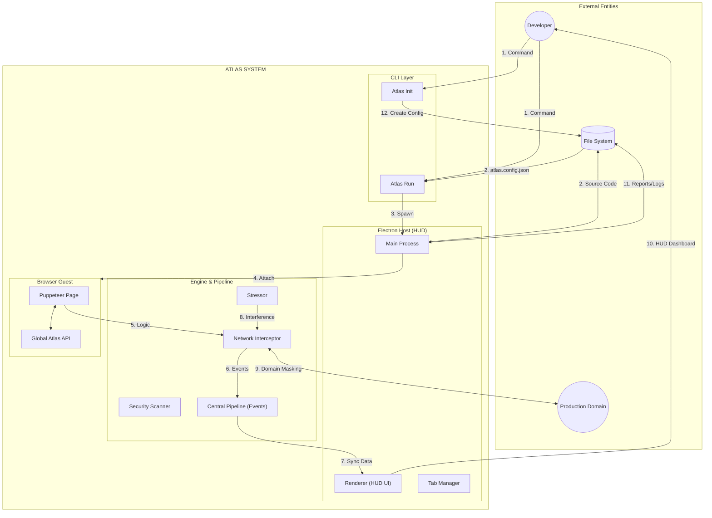

# Context Level Data Flow Diagram (DFD)

This diagram represents the highest level view of the Atlas system, showing the main external entities and data flows based on the Electron-based architecture.

## Data Flow Descriptions

| #   | Flow            | Source              | Destination         | Data                               |
| --- | --------------- | ------------------- | ------------------- | ---------------------------------- |
| 1   | Command         | Developer           | CLI Layer           | CLI Execution (init, run)          |
| 2   | Source / Config | File System         | CLI / Main          | Project assets & atlas.config.json |
| 3   | Spawn           | Atlas Run           | Main Process        | Launch Electron Host               |
| 4   | Attach          | Main Process        | Browser Guest       | CDP connection and instrumentation |
| 5   | Logic           | Puppeteer Page      | Network Interceptor | HTTP/WS Traffic                    |
| 6   | Events          | Network Interceptor | Central Pipeline    | Intercepted events & violations    |
| 7   | Sync Data       | Central Pipeline    | Renderer (HUD UI)   | Live data feed to UI               |
| 8   | Interference    | Stressor            | Network Interceptor | Injected latency/errors            |
| 9   | Domain Masking  | Network Interceptor | Production Domain   | Proxied traffic                    |
| 10  | HUD Dashboard   | Renderer (HUD UI)   | Developer           | Interactive visual interface       |
| 11  | Reports/Logs    | Main Process        | File System         | Persisted audit results            |
| 12  | Create Config   | Atlas Init          | File System         | atlas.config.json                  |

## Process Descriptions

| Process             | Description                                                                       |
| ------------------- | --------------------------------------------------------------------------------- |
| CLI Layer           | Handles project initialization and session startup via the terminal.              |
| Electron Host (HUD) | Provides the native container, window management, and the visual dashboard.       |
| Engine & Pipeline   | Core analytical layer that processes traffic, applies security, and emits events. |
| Browser Guest       | The isolated web environment where the target application runs.                   |
| Stressor            | Module formerly known as Chaos Engine; responsible for stability testing.         |
| Network Interceptor | Intercepts all traffic for proxying and analysis.                                 |
