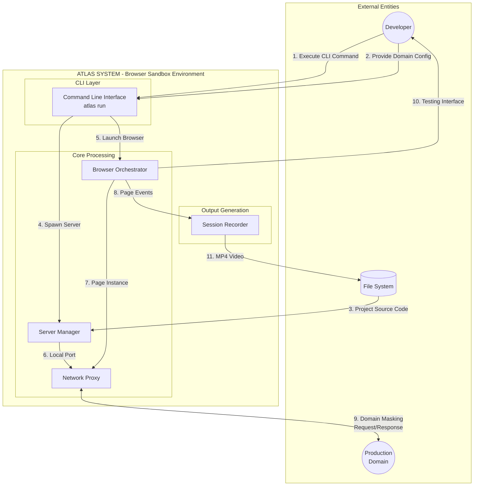

# Context Level Data Flow Diagram (DFD)

This diagram represents the highest level view of the Atlas system, showing the main external entities and data flows.

## Data Flow Descriptions

| #   | Flow              | Source         | Destination          | Data                        |
| --- | ----------------- | -------------- | -------------------- | --------------------------- |
| 1   | CLI Command       | Developer      | CLI                  | atlas run                   |
| 2   | Domain Config     | Developer      | CLI                  | Domain name, Port           |
| 3   | Source Code       | File System    | Server Manager       | package.json, Project files |
| 4   | Spawn Server      | CLI            | Server Manager       | Project path, Log callback  |
| 5   | Launch Browser    | CLI            | Browser Orchestrator | Domain, Port, Path          |
| 6   | Local Port        | Server Manager | Network Proxy        | Port number                 |
| 7   | Page Instance     | Browser        | Network Proxy        | Puppeteer Page object       |
| 8   | Page Events       | Browser        | Session Recorder     | User interactions           |
| 9   | Domain Masking    | Network Proxy  | Production Domain    | HTTP Requests/Responses     |
| 10  | Testing Interface | Browser        | Developer            | Floating UI with tools      |
| 11  | Video Output      | Recorder       | File System          | session-*.mp4               |

## Process Descriptions

| Process              | Input            | Output                  | Function                      |
| -------------------- | ---------------- | ----------------------- | ----------------------------- |
| CLI                  | Commands, Config | Server/Browser triggers | Parse args, orchestrate flow  |
| Server Manager       | Project path     | Running server on port  | Install, build, spawn process |
| Browser Orchestrator | Domain, Port     | Puppeteer instance      | Launch browser, inject tools  |
| Network Proxy        | HTTP Requests    | Proxied Responses       | Domain masking, interception  |
| Session Recorder     | User events      | MP4                     | Capture video                 |
