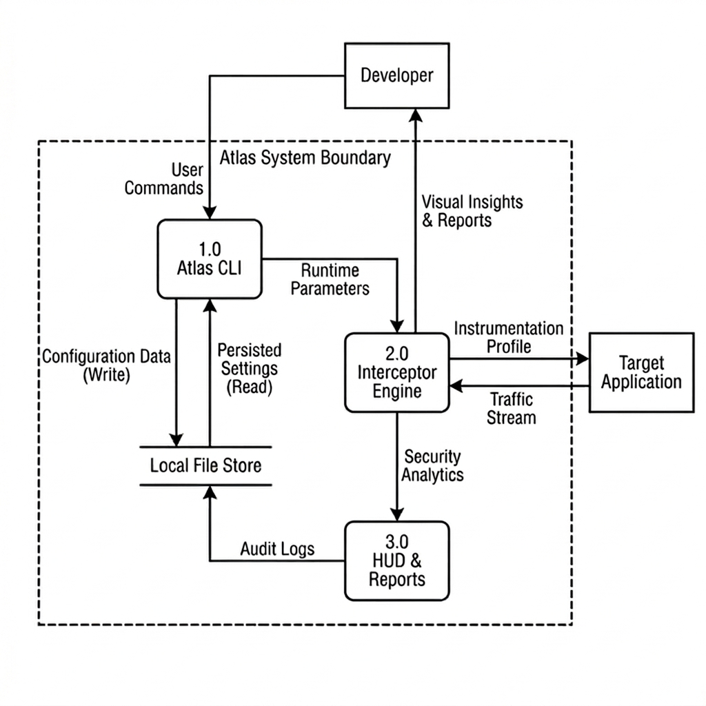

# Level-1 Data Flow Diagram (DFD)

This diagram represents the Level-1 view of the Atlas system, showing the major processes (1.0, 2.0, 3.0) and their internal data flows.

## Data Flow Descriptions

| #   | Flow                    | Source              | Destination         | Data                               |
| --- | ----------------------- | ------------------- | ------------------- | ---------------------------------- |
| 1   | User Commands           | Developer           | 1.0 Atlas CLI       | CLI Execution (init, run)          |
| 2   | Configuration Data (W)  | 1.0 Atlas CLI       | Local File Store    | Write atlas.config.json & settings |
| 3   | Persisted Settings (R)  | Local File Store    | 1.0 Atlas CLI       | Read configuration & state         |
| 4   | Runtime Parameters      | 1.0 Atlas CLI       | 2.0 Interceptor Eng | Session & injection settings       |
| 5   | Instrumentation Profile | 2.0 Interceptor Eng | Target Application  | CDP hooks & script injection       |
| 6   | Traffic Stream          | Target Application  | 2.0 Interceptor Eng | Outbound HTTP/WS requests          |
| 7   | Security Analytics      | 2.0 Interceptor Eng | 3.0 HUD & Reports   | Intercepted events & violations    |
| 8   | Visual Insights & Reps  | 2.0 Interceptor Eng | Developer           | Live data feed & visual alerts     |
| 9   | Audit Logs              | 3.0 HUD & Reports   | Local File Store    | Persisted audit results            |

## Process Descriptions

| Process                | Description                                                                       |
| ---------------------- | --------------------------------------------------------------------------------- |
| 1.0 Atlas CLI          | Primary entry point for developers to initialize and launch monitoring sessions.  |
| 2.0 Interceptor Engine | Core analytical layer that instruments target apps and processes network traffic. |
| 3.0 HUD & Reports      | Generates visual dashboards and permanent audit logs of security events.          |
