# Entity Relationship Diagram

This diagram shows the data entities, their attributes, and relationships in the Atlas system.

```mermaid
erDiagram
    PROJECT ||--o{ SESSION : "hosts"
    SESSION ||--o{ NETWORK_REQUEST : "intercepts"
    SESSION ||--o{ SESSION_EVENT : "captures"
    SESSION ||--o| VIDEO_RECORDING : "produces"
    SESSION ||--o| VISUAL_MANUAL : "generates"
    SESSION ||--o{ VIOLATION : "detects"
    SESSION ||--|| NETWORK_CONFIG : "uses"
    SESSION ||--o| CHAOS_CONFIG : "applies"
    
    PROJECT {
        string path PK "Absolute project directory path"
        string name "Project name from path"
        boolean hasPackageJson "Determines Auto/Manual mode"
        number serverPort "Dynamically assigned port"
        string startScript "npm start or npm run dev"
    }
    
    SESSION {
        string sessionId PK "Unique identifier"
        datetime createdAt "Session start timestamp"
        datetime endedAt "Session end timestamp"
        string maskedDomain "Production domain to simulate"
        string throttlingProfile "Network condition preset"
        string securityMode "Standard or Strict"
        boolean isRecording "Video capture active"
    }
    
    NETWORK_CONFIG {
        string domain FK "Target production domain"
        number localPort "Localhost port to proxy"
        boolean interceptEnabled "Request interception flag"
    }
    
    NETWORK_REQUEST {
        string requestId PK "Unique request ID"
        string sessionId FK "Parent session"
        string url "Full request URL"
        string method "GET POST PUT DELETE etc"
        number statusCode "HTTP response status"
        number durationMs "Request time in ms"
        json requestHeaders "Outgoing headers"
        json responseHeaders "Incoming headers"
        text responseBody "Truncated response body"
        string inferredType "Doc Script API Image etc"
        datetime timestamp "Request time"
    }
    
    SESSION_EVENT {
        string eventId PK "Unique event ID"
        string sessionId FK "Parent session"
        string eventType "NAVIGATION ACTION INPUT ERROR"
        string pageUrl "Current page path"
        datetime timestamp "Event time"
        json eventDetails "Type-specific data"
    }
    
    VIDEO_RECORDING {
        string recordingId PK "Unique recording ID"
        string sessionId FK "Parent session"
        string filePath "Output MP4 file path"
        datetime startTime "Recording start"
        datetime endTime "Recording end"
        number fileSizeBytes "Output file size"
    }
    
    VISUAL_MANUAL {
        string manualId PK "Unique manual ID"
        string sessionId FK "Parent session"
        string filePath "Output MD file path"
        string projectName "Project identifier"
        number pagesVisited "Unique pages count"
        number totalEvents "Captured events count"
        datetime generatedAt "Creation timestamp"
    }
    
    VIOLATION {
        string violationId PK "Unique violation ID"
        string sessionId FK "Parent session"
        string source "Detector module name"
        string message "Violation description"
        number severityLevel "0 INFO 1 WARN 2 ERROR"
        datetime detectedAt "Detection timestamp"
    }
    
    CHAOS_CONFIG {
        string configId PK "Config identifier"
        string sessionId FK "Parent session"
        boolean isEnabled "Master toggle"
        number errorRate "Percentage 0-50"
        number latencyRate "Percentage 0-50"
        number dropRate "Percentage 0-20"
    }
```

## Entity Descriptions

| Entity          | Description                         | Cardinality      | Storage Location  |
| --------------- | ----------------------------------- | ---------------- | ----------------- |
| PROJECT         | User's web application being tested | 1 per run        | File System       |
| SESSION         | Active Atlas sandbox instance       | Many per project | Runtime Memory    |
| NETWORK_CONFIG  | Proxy configuration                 | 1 per session    | Runtime Memory    |
| NETWORK_REQUEST | Intercepted HTTP request/response   | Many per session | Runtime Queue     |
| SESSION_EVENT   | User interaction or system event    | Many per session | Runtime Array     |
| VIDEO_RECORDING | Screen capture output               | 0-1 per session  | File System (MP4) |
| VISUAL_MANUAL   | Generated markdown report           | 0-1 per session  | File System (MD)  |
| VIOLATION       | Security or health issue            | Many per session | Runtime State     |
| CHAOS_CONFIG    | Failure injection settings          | 0-1 per session  | Runtime State     |

## Relationship Summary

| Relationship              | Type                  | Description                               |
| ------------------------- | --------------------- | ----------------------------------------- |
| PROJECT - SESSION         | One-to-Many           | A project can have multiple test sessions |
| SESSION - NETWORK_REQUEST | One-to-Many           | Each session captures multiple requests   |
| SESSION - SESSION_EVENT   | One-to-Many           | Each session logs multiple events         |
| SESSION - VIDEO_RECORDING | One-to-One (Optional) | Recording is optional                     |
| SESSION - VISUAL_MANUAL   | One-to-One (Optional) | Generated after recording                 |
| SESSION - VIOLATION       | One-to-Many           | Multiple violations possible              |
| SESSION - NETWORK_CONFIG  | One-to-One            | Each session has one config               |
| SESSION - CHAOS_CONFIG    | One-to-One (Optional) | Chaos mode is optional                    |
