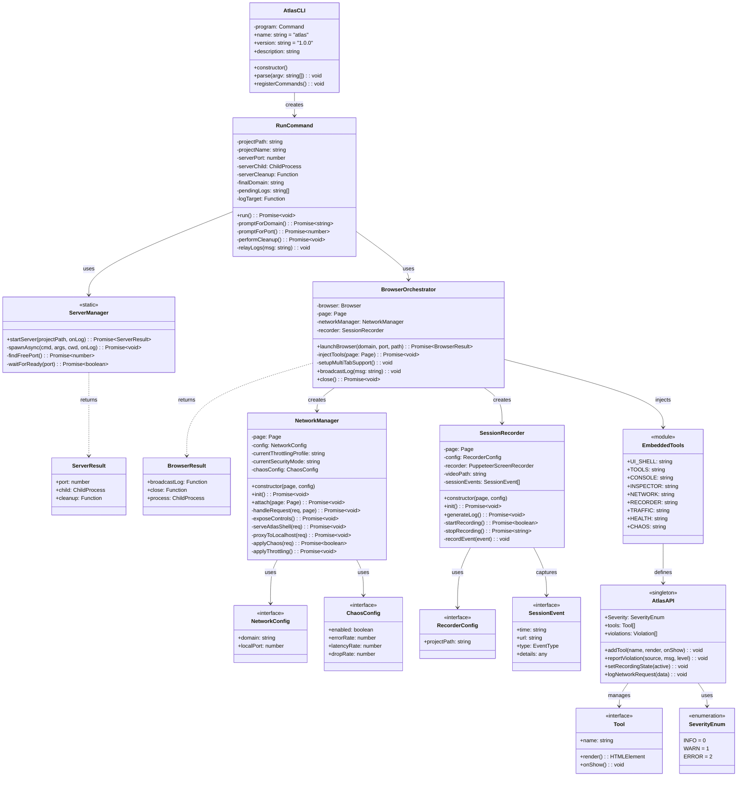

# Class Diagram

This diagram shows the object-oriented structure of the Atlas codebase with classes, interfaces, and their relationships.

## Class Responsibilities

| Class               | File Location                  | Responsibility                           |
| ------------------- | ------------------------------ | ---------------------------------------- |
| AtlasCLI            | atlas.ts                       | CLI entry point, command registration    |
| RunCommand          | src/commands/run.ts            | Main orchestration, lifecycle management |
| ServerManager       | src/utils/server.ts            | Project server spawning and management   |
| BrowserOrchestrator | src/utils/browser.ts           | Puppeteer browser control                |
| NetworkManager      | src/utils/network-manager.ts   | Request interception, domain proxying    |
| SessionRecorder     | src/utils/session-recorder.ts  | Video capture, event logging             |
| AtlasAPI            | src/utils/embedded/ui-shell.ts | In-browser global API                    |
| EmbeddedTools       | src/utils/embedded/index.ts    | Tool panel scripts                       |

## Design Patterns Used

| Pattern   | Implementation            | Purpose                           |
| --------- | ------------------------- | --------------------------------- |
| Singleton | AtlasAPI (window.Atlas)   | Single global API instance        |
| Factory   | ServerManager.startServer | Create appropriate server type    |
| Observer  | Event listeners           | Broadcast logs, violations        |
| Proxy     | NetworkManager            | Intercept and forward requests    |
| Module    | EmbeddedTools             | Encapsulate tool scripts          |
| Strategy  | Throttling profiles       | Interchangeable network behaviors |
