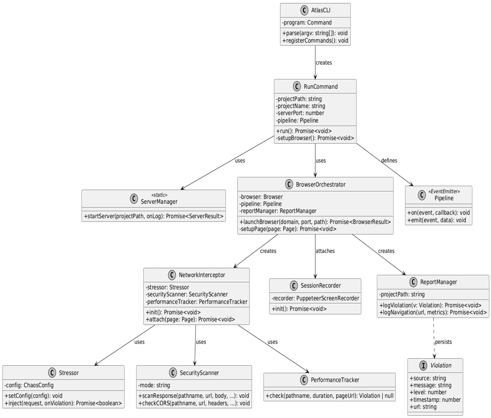

# Class Diagram

This diagram shows the object-oriented structure of the Atlas codebase with classes, interfaces, and their relationships, based on the reference architecture.

## Class Responsibilities

| Class               | Responsibility                                             |
| ------------------- | ---------------------------------------------------------- |
| AtlasCLI            | Entry point for CLI commands and argument parsing.         |
| RunCommand          | Orchestrates the server and browser lifecycle.             |
| ServerManager       | Manages the local project server process.                  |
| BrowserOrchestrator | Controls the Puppeteer instance and tool injection.        |
| Pipeline            | Central event bus for system-wide communications.          |
| NetworkInterceptor  | Intercepts and analyzes network traffic.                   |
| Stressor            | Injects latency and errors to test application resilience. |
| SecurityScanner     | Scans for PII and security policy violations.              |
| PerformanceTracker  | Monitors and reports on network response times.            |
| SessionRecorder     | Captures video and user interaction logs.                  |
| ReportManager       | Generates JSON and Markdown audit reports.                 |
