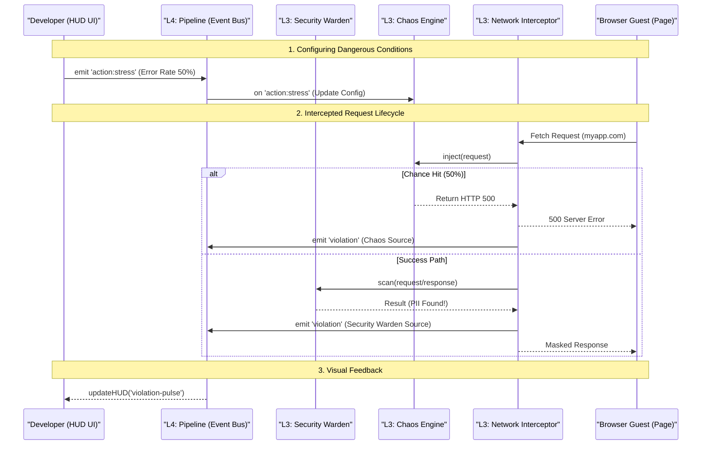

# Interaction Diagram

This diagram illustrates how data flows through the **7-Layer Architecture** during a developer interaction, specifically showing the **Layer 4 Pipeline** as the central bus.

## Communication Patterns

1.  **Asynchronous Observation (README Layer 4)**: The Engine (Layer 3) never waits for the UI (Layer 6) to render. All monitoring data is sent to the **Pipeline** and processed out-of-band.
2.  **Shadow DOM Isolation**: The interaction between the **Guest Page** and the **Network Interceptor** is transparent to the guest app code.
3.  **Typed Events**: The Pipeline ensures that the 'Security Warden' and 'Chaos Engine' communicate using shared, typed definitions from `state.ts`.
