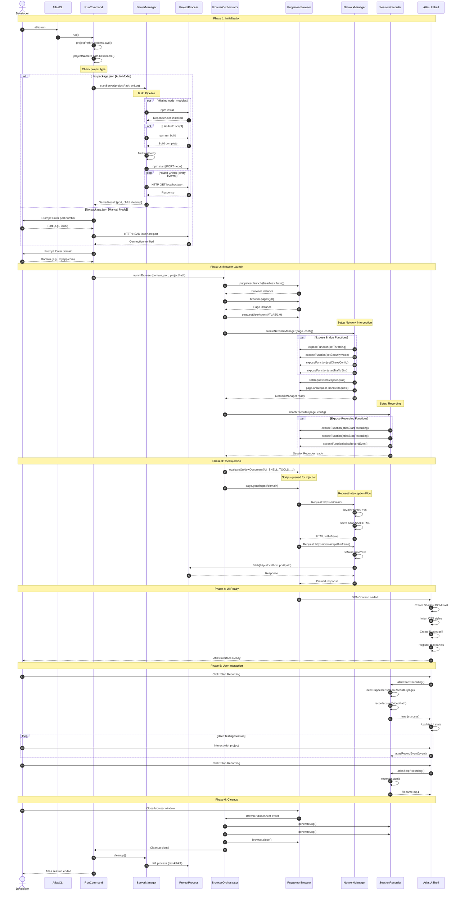

# Interaction Diagram (Sequence Diagram)

This diagram shows the complete sequence of interactions when a developer executes `atlas run`.

## Phase Summary

| Phase               | Steps | Components Involved                            | Description                                 |
| ------------------- | ----- | ---------------------------------------------- | ------------------------------------------- |
| 1. Initialization   | 1-18  | CLI, RunCommand, ServerManager                 | Parse command, start server, collect config |
| 2. Browser Launch   | 19-32 | BrowserOrchestrator, Puppeteer, NetworkManager | Launch browser, setup interception          |
| 3. Tool Injection   | 33-42 | Puppeteer, NetworkManager, SessionRecorder     | Inject scripts, navigate to domain          |
| 4. UI Ready         | 43-48 | AtlasUIShell                                   | Create floating interface                   |
| 5. User Interaction | 49-58 | User, SessionRecorder                          | Record session, capture events              |
| 6. Cleanup          | 59-67 | All components                                 | Generate output, kill processes             |

## Message Types

| Type        | Notation         | Description                      |
| ----------- | ---------------- | -------------------------------- |
| Synchronous | ->>              | Blocking call, wait for response |
| Response    | -->>             | Return value from sync call      |
| Internal    | ->>self          | Self-invocation                  |
| Parallel    | par...end        | Concurrent execution             |
| Optional    | opt...end        | Conditional execution            |
| Loop        | loop...end       | Repeated execution               |
| Alternative | alt...else...end | Conditional branching            |
