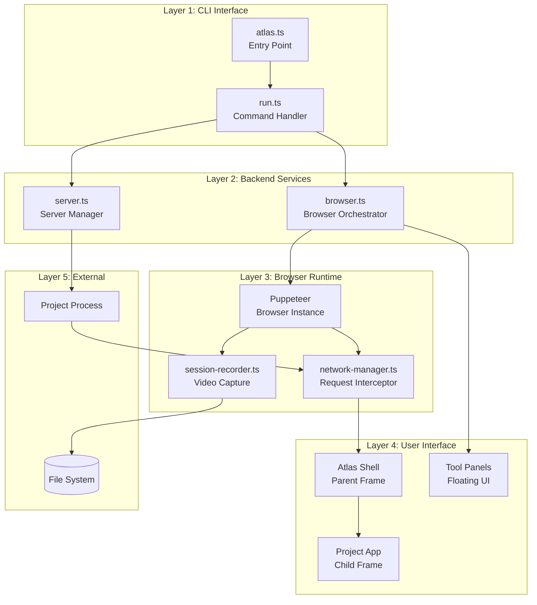
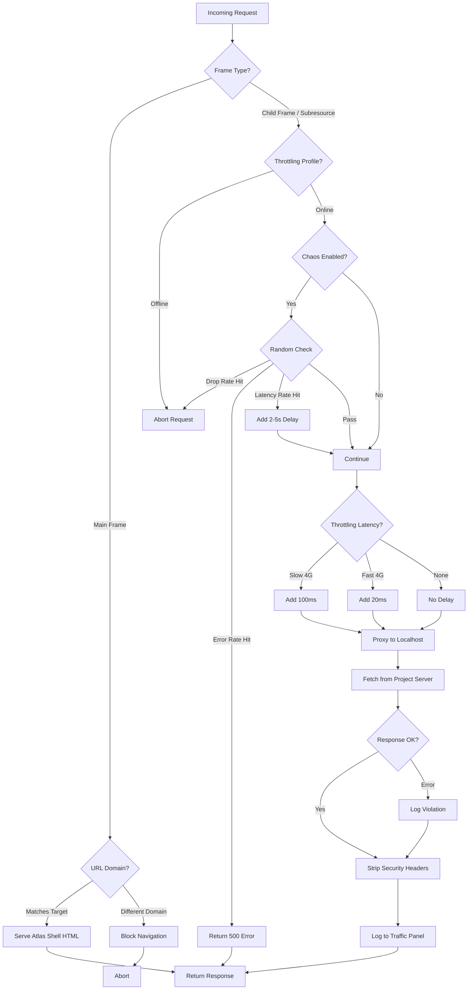
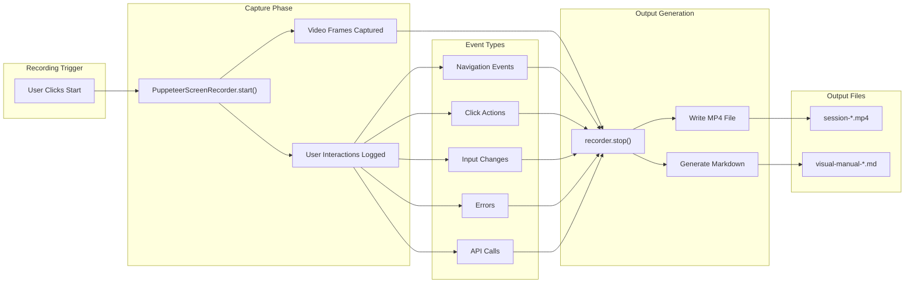
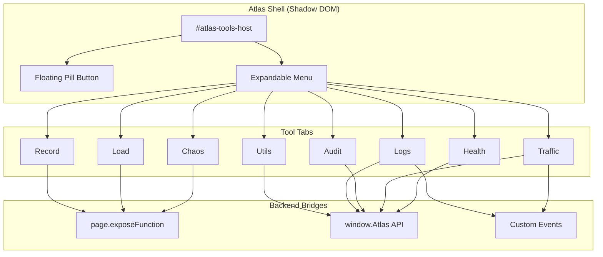
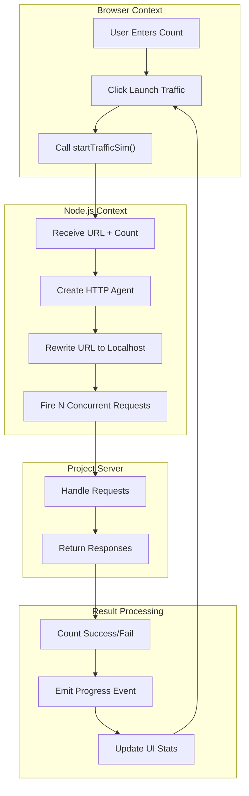
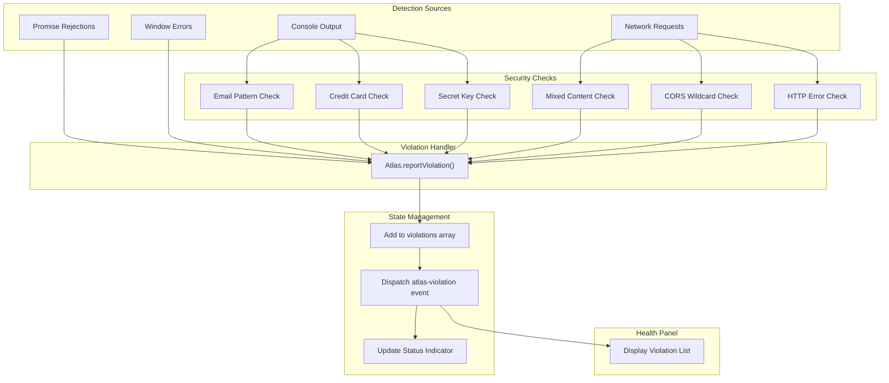

# System Flow Diagram

Comprehensive view of the Atlas system architecture, component relationships, and data flows.

---

## 1. High-Level Architecture

---

## 2. Request Processing Flow

---

## 3. Session Recording Flow

---

## 4. Tool Panel Architecture

---

## 5. Multi-User Load Test Flow

---

## 6. Security Violation Detection Flow

---

## 7. Component Communication Matrix

| From                | To                  | Mechanism             | Data                        |
| ------------------- | ------------------- | --------------------- | --------------------------- |
| CLI                 | ServerManager       | Function call         | projectPath, onLog callback |
| CLI                 | BrowserOrchestrator | Function call         | domain, port, projectPath   |
| ServerManager       | ProjectProcess      | child_process.spawn   | npm commands                |
| BrowserOrchestrator | Puppeteer           | Puppeteer API         | Launch options              |
| BrowserOrchestrator | NetworkManager      | Constructor           | Page, NetworkConfig         |
| BrowserOrchestrator | SessionRecorder     | Constructor           | Page, RecorderConfig        |
| NetworkManager      | ProjectProcess      | Node fetch()          | HTTP requests               |
| NetworkManager      | AtlasUI             | page.evaluate()       | Request logs                |
| SessionRecorder     | FileSystem          | fs.writeFile()        | MP4, Markdown               |
| AtlasUI             | NetworkManager      | exposeFunction bridge | Config changes              |
| AtlasUI             | SessionRecorder     | exposeFunction bridge | Recording commands          |
| ProjectIframe       | AtlasUI             | postMessage           | Console logs, URL changes   |

---

## 8. Startup Sequence Timeline

```mermaid
gantt
    title Atlas Startup Timeline
    dateFormat X
    axisFormat %s
    
    section CLI
    Parse Command           :0, 1
    Validate Project        :1, 2
    
    section Server
    npm install             :2, 5
    npm build               :5, 8
    Find Port               :8, 9
    npm start               :9, 12
    Health Check            :12, 15
    
    section Browser
    Launch Puppeteer        :15, 17
    Setup NetworkManager    :17, 18
    Setup Recorder          :18, 19
    Inject Tools            :19, 20
    Navigate to Domain      :20, 22
    
    section UI
    Create Shadow DOM       :22, 23
    Render Pill             :23, 24
    Register Tools          :24, 25
    Ready                   :25, 26
```

---

## 9. Error Handling Paths

| Component           | Error Type             | Handling       | User Feedback       |
| ------------------- | ---------------------- | -------------- | ------------------- |
| ServerManager       | npm install fails      | Reject promise | Console error, exit |
| ServerManager       | npm build fails        | Reject promise | Console error, exit |
| ServerManager       | Server won't start     | 30s timeout    | Proceed anyway      |
| BrowserOrchestrator | Puppeteer launch fails | Throw error    | Console error, exit |
| NetworkManager      | Proxy request fails    | Abort request  | Connection refused  |
| SessionRecorder     | Recording start fails  | Return false   | UI shows failure    |
| AtlasUI             | Tool render error      | try/catch      | Console error       |
