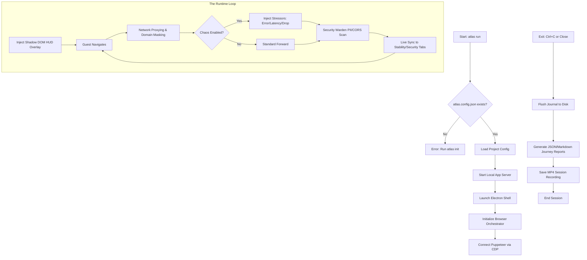

# System Flow & Architecture Diagram

This diagram maps both the **Operational Flow** and the **Layered Architecture** of Atlas, as defined in the project's README.

## 1. Operational System Flow

## 2. Layered Architecture (The Brain)

Atlas follows a 7-layer event-driven architecture connected by a Typed Event Pipeline.

| Layer | Component          | Responsibility                                                  |
| :---- | :----------------- | :-------------------------------------------------------------- |
| **1** | **CLI Interface**  | Entry points (`atlas.ts`), Command parsing, Env setup.          |
| **2** | **Infrastructure** | spawning dev servers (`server.ts`), Puppeteer orchestrator.     |
| **3** | **Engine (Brain)** | Core logic: Interceptor, Warden, Chaos, Performance, Recorder.  |
| **4** | **Pipeline**       | Typed Event Bus — Central Nervous System for all layers.        |
| **5** | **Electron Shell** | Main process lifecycle and Native IPC (Recording/Auth).         |
| **6** | **HUD UI Overlay** | Shadow DOM injected into the guest page for tool visualization. |
| **7** | **Collectors**     | Link scanning and Storage metrics background gatherers.         |

> [!TIP]
> This layered approach ensures that the **HUD UI** (Layer 6) remains isolated from the **Guest Application** logic through Shadow DOM and non-blocking asynchronous event emission via the **Pipeline** (Layer 4).
